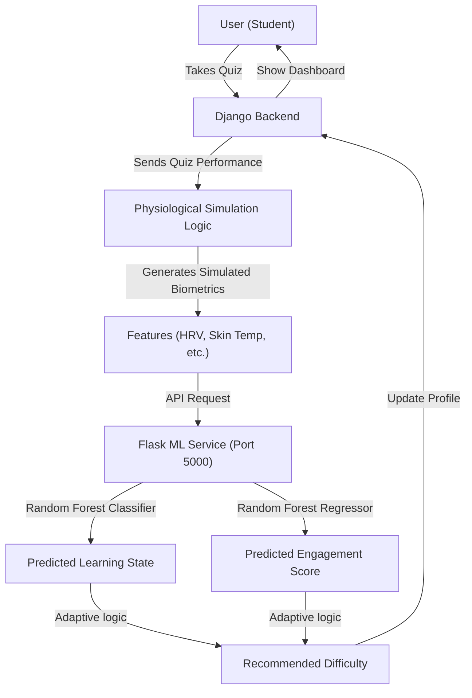

# Personalized Learning Recommendation System (PLRS) - Comprehensive Report

## 1. Executive Summary

The Personalized Learning Recommendation System (PLRS) is an innovative, hybrid architecture application designed to provide adaptive educational experiences to students. Recognizing the limitations of standard web environments in gathering physiological data (such as heart rate or facial expressions), the PLRS employs a unique simulation layer. It extrapolates likely physiological states based on user interaction metrics (quiz performance, time spent) and uses this data to drive a Machine Learning microservice. The system dynamically classifies a student's learning state and predicts their engagement, adjusting the difficulty of subsequent material in real-time.

## 2. System Architecture & Design

The PLRS utilizes a microservices architecture, separating the web-facing application logic from the intensive machine learning inferences. 

### 2.1 Component Overview

1. **Django Backend**: Serves as the primary web application framework. It manages user accounts, quiz delivery, profile updates, and the initial processing of user interaction metrics.
2. **Flask ML Microservice**: A dedicated, lightweight REST API service that handles all machine learning inferences. It loads pre-trained Scikit-Learn models into memory and serves predictions via HTTP endpoints.
3. **Database Layer**: A MySQL database (`plrs_db`) is used for relational data storage (handled via `mysqlclient`), while an SQLite fallback exists for local testing in Django.

### 2.2 Architecture Flowchart


## 3. Machine Learning Pipeline

The ML pipeline is entirely encapsulated within the `ml_service` directory, consisting of `train_model.py` and `app.py`. 

### 3.1 Data Acquisition & Simulation Strategy
Real-world student physiological data can be difficult to obtain. The system includes a fallback synthetic data generator within `train_model.py`. If `simulated_student_learning_data.csv` is missing, it generates up to 1000 samples of mock data. The dataset includes both physiological proxies and traditional metrics:
- **Physiological Features**: `HRV` (Heart Rate Variability), `Skin_Temperature`, `Expression_Joy`, `Expression_Confusion`, `Steps`, `Session_Duration`.
- **Traditional Features**: `topic_accuracy`, `avg_time_per_question`, `retry_rate`, `skip_rate`, `attempt_count`.

### 3.2 Model Selection
The system uses Ensemble Methods due to their robustness against overfitting and ability to handle non-linear relationships.
- **Random Forest Classifier**: Used to classify the categorical `learning_state` (e.g., focused, confusion, boredom). It is instantiated with 100 estimators.
- **Random Forest Regressor**: Used to predict the continuous `engagement_level` (proxy for next score prediction). It is also instantiated with 100 estimators.

### 3.3 Training & Evaluation
The training pipeline (`train_model.py`) performs the following:
1. Loads the CSV or generates synthetic data.
2. Checks the schema (physiological dataset vs generic feature set).
3. Re-maps raw 'Emotion' labels (Interest, Happiness, Boredom, Confusion) to system learning states (`focused`, `boredom`, `confusion`).
4. Performs an 80/20 train-test split.
5. Standardizes features using `StandardScaler`.
6. Fits the models and evaluates them.

**Baseline Metrics:**
| Metric | Value | Description |
| :--- | :--- | :--- |
| **Accuracy** | 45.8% | Overall correctness of Learning State prediction. |
| **Precision** | 38.1% | Precision in identifying specific states. |
| **Recall** | 45.8% | Ability to find instances of specific states. |
| **RMSE** | 1.50 | Root Mean Squared Error for Engagement Score prediction. |
*(Note: These metrics are derived from the synthetic/initial dataset and establish a baseline for future real-world data collection.)*

Models are serialized using `joblib` and saved to the `models/` directory (`rf_classifier.pkl`, `rf_regressor.pkl`, `scaler.pkl`, `feature_names.pkl`, `metrics.json`).

### 3.4 Model Serving (Flask API)
The `app.py` script initializes a Flask server. Upon startup, it loads the serialized models into memory globally to prevent disk I/O on every request.

**Endpoints:**
- `POST /predict`: Accepts a JSON payload of student features. It dynamically handles missing features by padding them with 0s, scales the input array, and returns the classification, regression output, and a heuristic recommendation.
- `POST /retrain`: Triggers the `train_model.py` script to retrain the models dynamically and hot-reloads the new `.pkl` files into memory.
- `GET /metrics`: Returns the latest model performance metrics.

## 4. Physiological Data Simulation

Because a standard browser cannot easily read HRV or skin temperature without external hardware, the Django backend (as well as test scripts like `verify_system.py`) employs a simulation heuristic. 

### 4.1 Feature Mapping Logic
| User Behavior | Simulated Signal | Interpretation |
| :--- | :--- | :--- |
| **High Quiz Accuracy** | Increased **Expression_Joy** | User is satisfied and understanding material. |
| **Low Quiz Accuracy** | Increased **Expression_Confusion** | User is struggling. |
| **Stable Performance** | Stable **HRV** | User is focused and calm. |
| **Erratic Answers** | Low **HRV** (Stress) | User is guessing or frustrated. |

### 4.2 Code Implementation of Simulation
As seen in `verify_system.py`, the system generates pseudo-random biometrics anchored to the student's actual performance:
```python
accuracy = 0.85 
base_joy = accuracy
base_confusion = 1.0 - accuracy
simulated_hrv = 60 + (accuracy * 20) + random.uniform(-5, 5)
simulated_skin_temp = 36.5 + random.uniform(-0.5, 0.5)
simulated_joy = max(0, min(1, base_joy + random.uniform(-0.1, 0.1)))
simulated_confusion = max(0, min(1, base_confusion + random.uniform(-0.1, 0.1)))
```

## 5. Adaptive Learning Logic & Scenarios

The Flask microservice acts as the decision engine. After predicting the state and score, it executes heuristic logic to determine the `recommended_level`.

### 5.1 Decision Logic
```python
rec_level = 'medium' # Default
if class_pred in ['confusion', 'guessing', 'frustration']:
    rec_level = 'easy'
elif class_pred in ['boredom', 'focused']:
    if float(reg_pred) > 75:
        rec_level = 'hard'
```

### 5.2 Example Scenarios

#### Scenario A: The Struggling Student
- **Simulated State**: `confusion`
- **System Action**: Recommends `easy`.
- **Goal**: Reduce frustration by offering simpler questions to rebuild confidence.

#### Scenario B: The Bored Expert
- **Simulated State**: `boredom`
- **Engagement Prediction**: > 75
- **System Action**: Recommends `hard`.
- **Goal**: Introduce more complex challenges to re-engage the student.

#### Scenario C: The Focused Learner
- **Simulated State**: `focused`
- **Engagement Prediction**: > 75
- **System Action**: Recommends `hard` (or maintains flow).
- **Goal**: Keep the student in a state of optimal challenge (Flow State).

## 6. System Verification & Integration

The project includes robust verification scripts to ensure the microservices communicate effectively.

- **`verify_system.py`**: Acts as a mock Django client. It generates a simulated physiological payload and POSTs it to the Flask `/predict` endpoint. It validates that the response contains `learning_state`, `next_score_prediction`, and `recommended_level`.
- **`verify_all.py`**: A health-check script that probes `http://127.0.0.1:5000` (Flask) and `http://127.0.0.1:8000` (Django) to confirm both servers are actively listening.

## 7. Setup & Requirements

### Dependencies (`requirements.txt`)
- `django`, `flask`: Web frameworks.
- `scikit-learn`, `pandas`, `numpy`, `joblib`: Machine Learning, data manipulation, and model serialization.
- `mysqlclient`: Database connector.
- `requests`, `gunicorn`: HTTP operations and production WSGI serving.

### Database Initialization
The `create_db.py` script initializes the MySQL schema:
```python
import MySQLdb
db = MySQLdb.connect(host="localhost", user="root", passwd="")
cursor = db.cursor()
cursor.execute("CREATE DATABASE IF NOT EXISTS plrs_db")
```

## 8. Conclusion and Future Directions
The PLRS successfully demonstrates a closed-loop adaptive system. By using physiological simulation mapped to concrete performance metrics, it proves the viability of multimodal data for educational personalization. Future work should involve integration with actual hardware sensors (webcam emotion detection, wearable fitness trackers) to replace the simulation heuristics with real-world biometric data.
